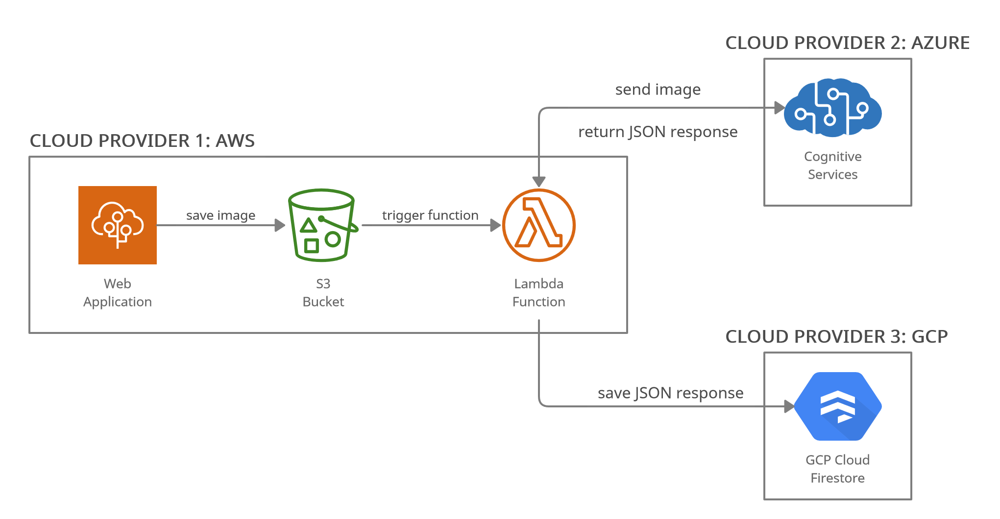

Image to JSON is multi-cloud image capture, upload and recognition application architected using 3 different Cloud Providers. This project is a result of ACloudGuru's [Multi-Cloud Madness](https://acloudguru.com/blog/engineering/cloudguruchallenge-multi-cloud-madness) challenge.

### Application Architecture

Project is built as Web Application using React and Express frameworks. The web application can capture image using the web camera and store capture image into object-store. The resulting JSON is stored in a database, which is then fetched and presented on the dashboard.

This project uses the following services of popular Cloud Providers -

- Azure Cognitive Services - Vision API for performing image recognition.

- AWS S3 bucket for storing captured images.

- AWS Lambda for calling Vision API and storing response JSON in NOSQL database.

- GCP Firestore as NOSQL database to store JSON response.



### Development Environment

#### Setup on GCP

Create a Firestore Application and replace your web-app configuration in `config.js` file present in the root directory.

#### Azure

From the Azure dashboard, set up an application for Cognitive Service - Vision API. And get the required key and endpoint credentials.

#### AWS

Set up an IAM account with sufficient permissions of creating S3 and Lambda services. Update `.env` file present in root with required credentials to access put an object into the bucket.

Create an S3 storage bucket. Edit the bucket policy to make objects publicly accessible.

Next, create a new Lambda function. Setup S3 bucket as a trigger of Lambda function on every putObject request.

From project root directory, change to [lambda-function](https://github.com/dwivediabhimanyu/multicloud-challenge/tree/master/lambda-function "lambda-function") directory. Install all project dependencies and edit `serviceAccountKey.json` with your service account credentials.

Now zip and upload `lambda-function` content to AWS Lambda function.

Also, in Lambda environment variable update values for the following variable.

```

BUCKET_URI= s3 bucket URI

ENDPOINT= azure vision API endpoint

KEY= azure vision API key

```

#### On Local Computer

1. Install client dependencies. `npm run client-install`

2. Install server dependencies `npm i`

3. Run dev environment. `npm run dev`

The project will be up and running on localhost.

### Screenshot

Navigate to `./deployment_screenshots` directory which contains screenshots of application and deployments.

---

If you liked the Dynamic Text Header used in this README, check it out [here](https://gist.github.com/dwivediabhimanyu/f7f11956abc3ebd8015a668834c3d6c0).
